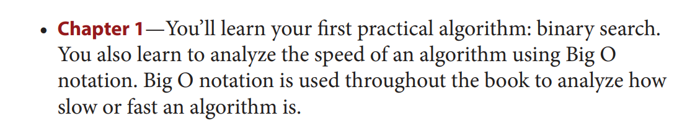
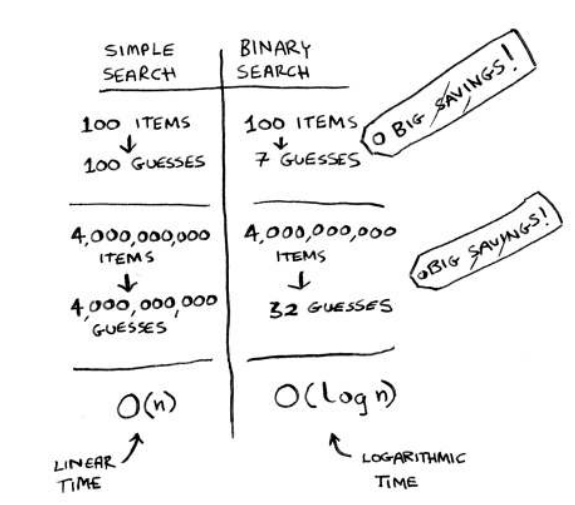
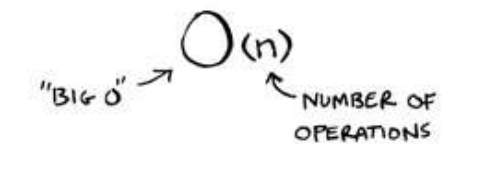

## Chapter 01

## Binary search

### Logarithms

Binary search only works when your list is in sorted order. For example, the names in a phone book are sorted in alphabetical order, so you can use binary search to look for a name. What would happen if the names weren’t sorted?

### EXERCISES
1.1 Suppose you have a sorted list of 128 names, and you’re searching
through it using binary search. What’s the maximum number of
steps it would take?

**Answer:** 7 steps. (2^7 = 128)

1.2 Suppose you double the size of the list. What’s the maximum
number of steps now?

**Answer:** 8 steps. (2^8 = 256)
log^x 2 = 256
x = 8

## Big O notation
Big O notation tells you how fast an algorithm is. For example, suppose
you have a list of size n. Simple search needs to check each element, so
it will take n operations. he run time in Big O notation is O(n). Where
are the seconds? here are none—Big O doesn’t tell you the speed in
seconds. Big O notation lets you compare the number of operations. It
tells you how fast the algorithm grows.

This tells you the number of operations an algorithm will make. It’s
called Big O notation because you put a “big O” in front of the number
of operations (it sounds like a joke, but it’s true!).

## Some common Big O run times

Here are ive Big O run times that you’ll encounter a lot, sorted from
fastest to slowest:

- O(log n), also known as log time. Example: Binary search.
- O(n), also known as linear time. Example: Simple search.
- O(n * log n). Example: A fast sorting algorithm, like quicksort
(coming up in chapter 4).
- O(n^2). Example: A slow sorting algorithm, like selection sort
(coming up in chapter 2).
- O(n!). Example: A really slow algorithm, like the traveling
salesperson (coming up next!).

### EXERCISES

Give the run time for each of these scenarios in terms of Big O.

1.3 You have a name, and you want to ind the person’s phone number
in the phone book. 

**Answer:** O(log n) - Binary search

1.5 You want to read the numbers of every person in the phone book.

**Answer:** O(n) - Simple search

1.6 You want to read the numbers of just the As. (his is a tricky one!
It involves concepts that are covered more in chapter 4. Read the
answer—you may be surprised!)

**Answer:** O(n). You may think, “I’m only doing this for 1 out
of 26 characters, so the run time should be O(n/26).” A simple
rule to remember is, ignore numbers that are added, subtracted,
multiplied, or divided. None of these are correct Big O run times: 

O(n + 26), O(n - 26), O(n * 26), O(n / 26). They’re all the same as
O(n)! Why? If you’re curious, flip to “Big O notation revisited,” in
chapter 4, and read up on constants in Big O notation (a constant
is just a number; 26 was the constant in this question).

**Recap**
- Binary search is a lot faster than simple search.
- O(log n) is faster than O(n), but it gets a lot faster once the list of
items you’re searching through grows.
- Algorithm speed isn’t measured in seconds.
- Algorithm times are measured in terms of growth of an algorithm.
- Algorithm times are written in Big O notation.