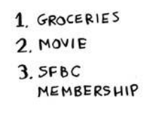
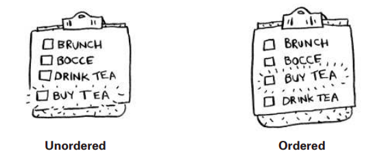
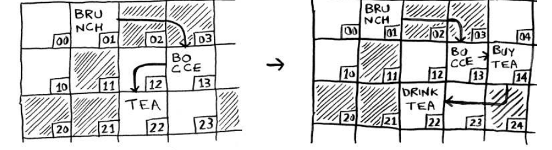
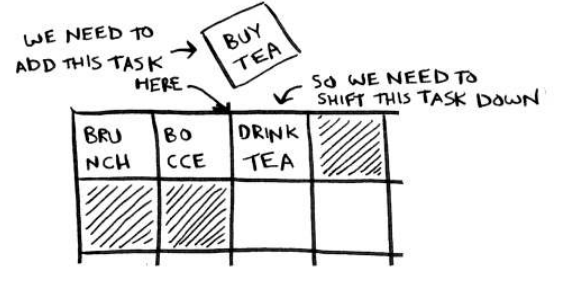
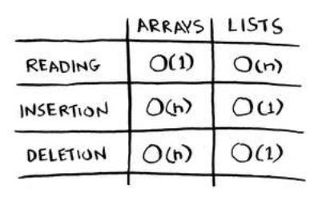
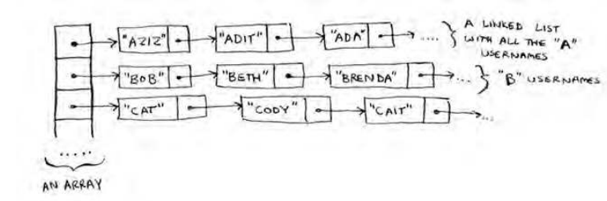

## Chapter 02

 - Sorting Algorithms, Arrays and Linked Lists

### EXERCISES

2.1 Suppose you’re building an app to keep track of your finances.

Every day, you write down everything you spent money on.
At the end of the month, you review your expenses and sum up how much
you spent. So, you have lots of inserts and a few reads. Should you
use an array or a list? 

**Answer:** A linked list would be better because it allows for efficient inserts. Arrays require shifting elements when inserting, which can be costly.

## Inserting into the middle of a list
Suppose you want your todo list to work more like a calendar. Earlier,
you were adding things to the end of the list.
Now you want to add them in the order in which they should
be done.

What’s better if you want to insert elements in the middle: arrays or
lists? With lists, it’s as easy as changing what the previous element
points to.

But for arrays, you have to shit all the rest of the elements down.

And if there’s no space, you might have to copy everything to a new
location! Lists are better if you want to insert elements into the middle

## Deletions

What if you want to delete an element? Again, lists are better, because
you just need to change what the previous element points to. With
arrays, everything needs to be moved up when you delete an element.
Unlike insertions, deletions will always work. Insertions can fail
sometimes when there’s no space let in memory. But you can always
delete an element.
Here are the run times for common operations on arrays and
linked lists.

It’s worth mentioning that insertions and deletions are O(1) time only
if you can instantly access the element to be deleted. It’s a common
practice to keep track of the irst and last items in a linked list, so it
would take only O(1) time to delete those.
Which are used more: arrays or lists? Obviously, it depends on the use
case. But arrays see a lot of use because they allow random access. here
are two diferent types of access: random access and sequential access.
Sequential access means reading the elements one by one, starting
at the irst element. Linked lists can only do sequential access. If you
want to read the 10th element of a linked list, you have to read the irst
9 elements and follow the links to the 10th element. Random access
means you can jump directly to the 10th element. You’ll frequently
hear me say that arrays are faster at reads. his is because they provide
random access. A lot of use cases require random access, so arrays are
used a lot. Arrays and lists are used to implement other data structures,
too (coming up later in the book).

### EXERCISES

2.4 People sign up for Facebook pretty often, too. Suppose you
decided to use an array to store the list of users. What are the
downsides of an array for inserts? In particular, suppose you’re
using binary search to search for logins. What happens when you
add new users to an array?

 Answer: Inserting into arrays is slow. Also, if you’re using binary
search to search for usernames, the array needs to be sorted.
Suppose someone named Adit B signs up for Facebook. Their
name will be inserted at the end of the array. So you need to sort
the array every time a name is inserted!

In reality, Facebook uses neither an array nor a linked list to store
user information. Let’s consider a hybrid data structure: an array
of linked lists. You have an array with 26 slots. Each slot points to a
linked list. For example, the first slot in the array points to a linked
list containing all the usernames starting with a. The second slot
points to a linked list containing all the usernames starting with b,
and so on.

Suppose Adit B signs up for Facebook, and you want to add them
to the list. You go to slot 1 in the array, go to the linked list for slot
1, and add Adit B at the end. Now, suppose you want to search for
Zakhir H. You go to slot 26, which points to a linked list of all the
Z names. Then you search through that list to find Zakhir H.
 Compare this hybrid data structure to arrays and linked lists. Is it
slower or faster than each for searching and inserting? You don’t
have to give Big O run times, just whether the new data structure
would be faster or slower. 

## Recap

- Your computer’s memory is like a giant set of drawers.
- When you want to store multiple elements, use an array or a list.
- With an array, all your elements are stored right next to each other.
- With a list, elements are strewn all over, and one element stores
the address of the next one.
- Arrays allow fast reads.
- Linked lists allow fast inserts and deletes.
- All elements in the array should be the same type (all ints,
all doubles, and so on).