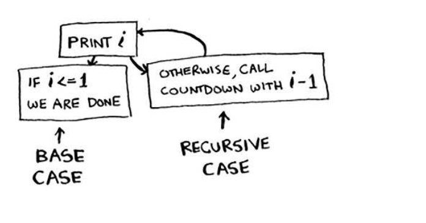

## Chapter 03

-  You learn about recursion. Recursion is a coding
technique used in many algorithms. It’s a building
block for understanding later chapters in this book.
-  You learn how to break a problem down into a
base case and a recursive case. The divide-andconquer strategy (chapter 4) uses this simple
concept to solve hard problems.


## Recursion

*"Loops may achieve a performance gain for your program. Recursion may achieve a performance gain for your programmer. Choose which is more important in your situation!"*

That’s why every recursive function has two parts: the base
case, and the recursive case. he recursive case is when the function calls
itself. he base case is when the function doesn’t call itself again … so it
doesn’t go into an ininite loop.



## The stack 


## The call stack
Your computer uses a stack internally called the call stack. Let’s see it in

action. Here’s a simple function:

```python
def greet(name):
    print("Hello, " + name + "!")
```
When you call `greet("Alice")`, here’s what happens:

1. The function `greet` is added to the call stack.
2. The code inside `greet` runs, printing "Hello, Alice!".
3. Once the function completes, it is removed from the call stack.

```python
def greet(name):
 print “hello, “ + name + “!”
 greet2(name)
 print “getting ready to say bye...”
 bye(name)
```

this function calls two other functions, `greet2` and `bye`. When you call `greet("Alice")`, the call stack looks like this:

1. `greet("Alice")` is added to the call stack.
2. Inside `greet`, `greet2("Alice")` is called, so
3. `greet2("Alice")` is added to the call stack on top of `greet`.
4. Once `greet2` completes, it is removed from the call stack, and
5. Control returns to `greet`, which continues executing.
6. Finally, when `greet` completes, it is removed from the call stack.

Exercise

3.2 Suppose you accidentally write a recursive function that runs
forever. As you saw, your computer allocates memory on the
stack for each function call. What happens to the stack when your
recursive function runs forever?

Answer: The stack grows forever. Each program has a limited
amount of space on the call stack. When your program runs
out of space (which it eventually will), it will exit with a stackoverflow error.

Recap
• Recursion is when a function calls itself.
• Every recursive function has two cases: the base case
and the recursive case.
• A stack has two operations: push and pop.
• All function calls go onto the call stack.
• he call stack can get very large, which takes up a lot of memory


Current page: 60