## Chapter 04

• You learn about divide-and-conquer. Sometimes
you’ll come across a problem that can’t be solved
by any algorithm you’ve learned. When a good
algorithmist comes across such a problem, they
don’t just give up. They have a toolbox full of
techniques they use on the problem, trying to
come up with a solution. Divide-and-conquer
is the irst general technique you learn.
• You learn about quicksort, an elegant sorting
algorithm that’s often used in practice. Quicksort
uses divide-and-conquer


## Divide-and-Conquer
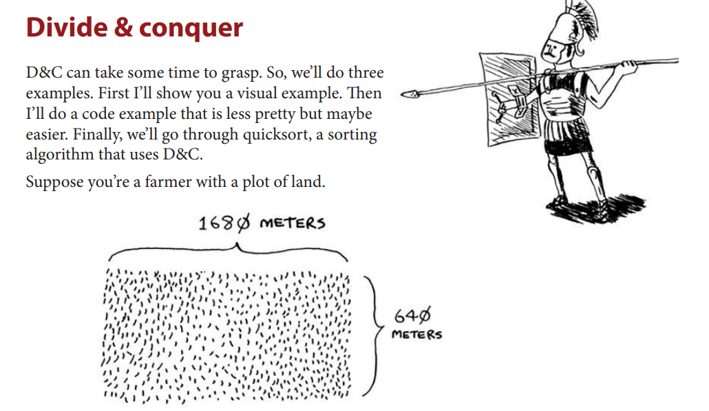

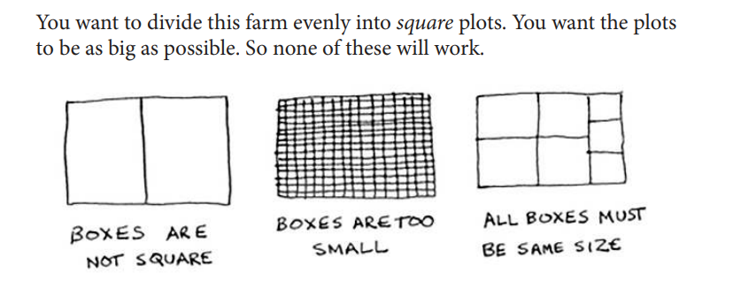

How do you igure out the largest square size you can use for a plot of
land? Use the D&C strategy! D&C algorithms are recursive algorithms.
To solve a problem using D&C, there are two steps:
1. Figure out the base case. his should be the simplest possible case.
2. Divide or decrease your problem until it becomes the base case.
Let’s use D&C to ind the solution to this problem. What is the largest
square size you can use?
First, igure out the base case. he easiest case would be if one side was
a multiple of the other side.

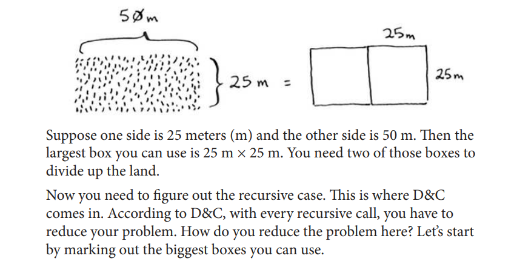

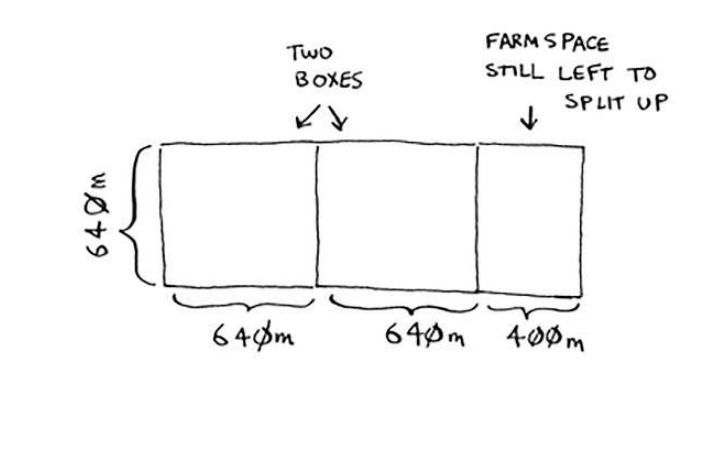

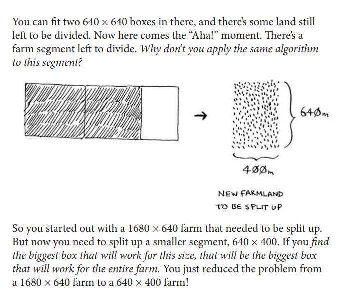

## Euclid’s algorithm
“If you ind the biggest box that will work for this size, that will be the
biggest box that will work for the entire farm.” If it’s not obvious to you
why this statement is true, don’t worry. It isn’t obvious. Unfortunately, the
proof for why it works is a little too long to include in this book, so you’ll
just have to believe me that it works. If you want to understand the proof,
look up Euclid’s algorithm. he Khan academy has a good explanation
here: https://www.khanacademy.org/computing/computer-science/
cryptography/modarithmetic/a/the-euclidean-algorithm.

## D&C (Divide and Conquer) Summary
To recap, here’s how D&C works:
1. Figure out a simple case as the base case.
2. Figure out how to reduce your problem and get to the base case

Example with a sum recursion function:

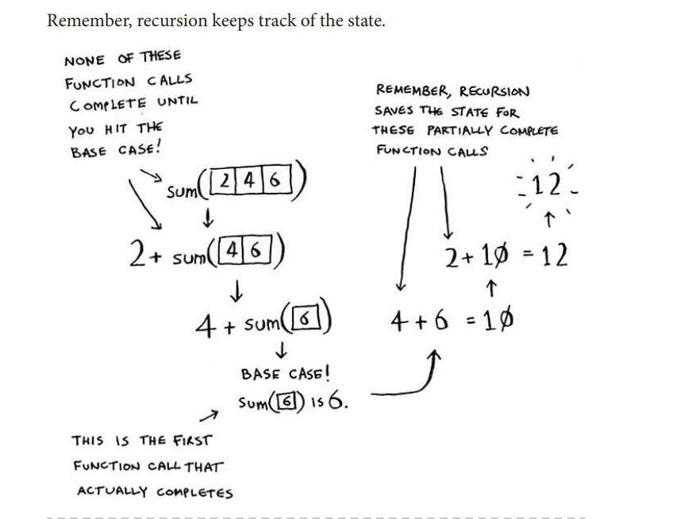

## Recursive function in Array(Tip)

When you’re writing a recursive function involving an array, the base case is
often an empty array or an array with one element. If you’re stuck, try that first.


## Functional programming
Why would I do this recursively if I can do it easily with a loop?” you
may be thinking. Well, this is a sneak peek into functional programming!
Functional programming languages like Haskell don’t have loops, so
you have to use recursion to write functions like this. If you have a good
understanding of recursion, functional languages will be easier to learn.
For example, here’s how you’d write a sum function in Haskell:

```haskell
sum [] = 0 (base case)
sum (x:xs) = x + sum xs (recursive case)
```

Notice that it looks like you have two deinitions for the function. he irst
deinition is run when you hit the base case. he second deinition runs
at the recursive case. You can also write this function in Haskell using an
if statement:

```haskell
sum arr = if arr == []
 then 0
 else (head arr) + (sum (tail arr))
```


## Quicksort

Quicksort is a sorting algorithm. It’s much faster than selection sort
and is frequently used in real life. For example, the C standard library
has a function called qsort, which is its implementation of quicksort.
Quicksort also uses D&C(Divide and Conquer). 

Empty arrays and arrays with just one element will be the base case. You
can just return those arrays as is—there’s nothing to sort:

```python
def quicksort(array):
 if len(array) < 2:
    return array
 ```

## Inductive proofs
You just got a sneak peak into inductive proofs! Inductive proofs are one
way to prove that your algorithm works. Each inductive proof has two
steps: the base case and the inductive case. Sound familiar? For example,
suppose I want to prove that I can climb to the top of a ladder. In the
inductive case, if my legs are on a rung, I can put my legs on the next rung.
So if I’m on rung 2, I can climb to rung 3. hat’s the inductive case. For
the base case, I’ll say that my legs are on rung 1. herefore, I can climb the
entire ladder, going up one rung at a time.
You use similar reasoning for quicksort. In the base case, I showed that the
algorithm works for the base case: arrays of size 0 and 1. In the inductive
case, I showed that if quicksort works for an array of size 1, it will work
for an array of size 2. And if it works for arrays of size 2, it will work for
arrays of size 3, and so on. hen I can say that quicksort will work for all
arrays of any size. I won’t go deeper into inductive proofs here, but they’re
fun and go hand-in-hand with D&C.

## Quicksort vs Merge sort

| Algorithm   | Best Case      | Average Case   | Worst Case     | Space Complexity | Stable? |
|-------------|----------------|----------------|----------------|------------------|---------|
| QuickSort   | O(n log n)     | O(n log n)     | O(n²)          | O(log n)         | No      |
| MergeSort   | O(n log n)     | O(n log n)     | O(n log n)     | O(n)             | Yes     |


There’s another sorting algorithm called merge sort, which is
O(n log n). Much faster! Quicksort is a tricky case. In the worst case,
quicksort takes O(n
2
) time.
It’s as slow as selection sort! But that’s the worst case. In the average
case, quicksort takes O(n log n) time. So you might be wondering:
• What do worst case and average case mean here?
• If quicksort is O(n log n) on average, but merge sort is O(n log n)
always, why not use merge sort? Isn’t it faster?

Quicksort versus merge sort is one example. Quicksort has a smaller constant than
merge sort. So if they’re both O(n log n) time, quicksort is faster. And
quicksort is faster in practice because it hits the average case way more
often than the worst case.


## Average case vs. worst case (Quicksort)
The performance of quicksort heavily depends on the pivot you choose.
Suppose you always choose the irst element as the pivot. And you
call quicksort with an array that is already sorted. Quicksort doesn’t
check to see whether the input array is already sorted. So it will still try
to sort it. 

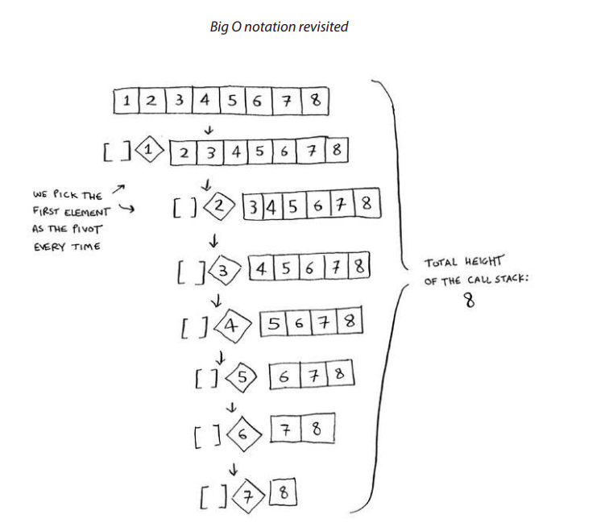

Notice how you’re not splitting the array into two halves. Instead, one
of the sub-arrays is always empty. So the call stack is really long. Now
instead, suppose you always picked the middle element as the pivot.
Look at the call stack now.

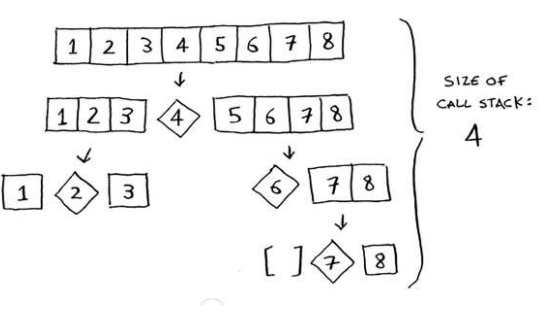

## Best case and Worst case stack size (Quicksort)

The first example you saw is the worst-case scenario, and the second
example is the best-case scenario. In the worst case, the stack size is
O(n). In the best case, the stack size is O(log n).

Now look at the first level in the stack. You pick one element as the
pivot, and the rest of the elements are divided into sub-arrays. You
touch all eight elements in the array. So this first operation takes O(n)
time. You touched all eight elements on this level of the call stack. But
actually, you touch O(n) elements on every level of the call stack.

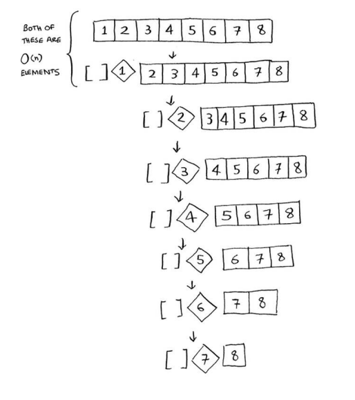

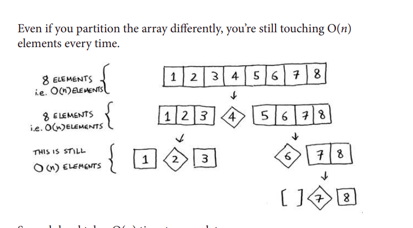

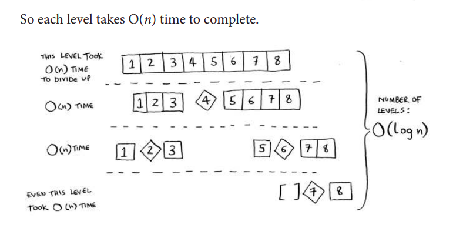

In this example, there are O(log n) levels (the technical way to say
that is, “The height of the call stack is O(log n)”). And each level takes
O(n) time. he entire algorithm will take O(n) * O(log n) = O(n log n)
time. his is the best-case scenario.

In the worst case, there are O(n) levels, so the algorithm will take
O(n) * O(n) = O(n^2) time.

Well, guess what? I’m here to tell you that the best case is also the
average case. If you always choose a random element in the array as the
pivot, quicksort will complete in O(n log n) time on average. Quicksort
is one of the fastest sorting algorithms out there, and it’s a very good
example of D&C.

## Exercises
How long would each of these operations take in Big O notation?

4.5 Printing the value of each element in an array. 

Answer: O(n)

4.6 Doubling the value of each element in an array. 

Answer: O(n)

4.7 Doubling the value of just the first element in an array. 

Answer: O(1)

4.8 Creating a multiplication table with all the elements in the array.
So if your array is [2, 3, 7, 8, 10], you first multiply every element
by 2, then multiply every element by 3, then by 7, and so on. 

Answer: O(n^2)

## Recap

• D&C works by breaking a problem down into smaller and smaller
pieces. If you’re using D&C on a list, the base case is probably an
empty array or an array with one element.

• If you’re implementing quicksort, choose a random element as the
pivot. 'The average runtime of quicksort is O(n log n)!

• The constant in Big O notation can matter sometimes. That’s why
quicksort is faster than merge sort.

• The constant almost never matters for simple search versus binary
search, because O(log n) is so much faster than O(n) when your list
gets big.

==> Choosing a random pivot makes the average case behavior of QuickSort more likely. It reduces the chance of always hitting the worst-case time complexity O(n^2), especially for adversarial inputs like already-sorted arrays.

