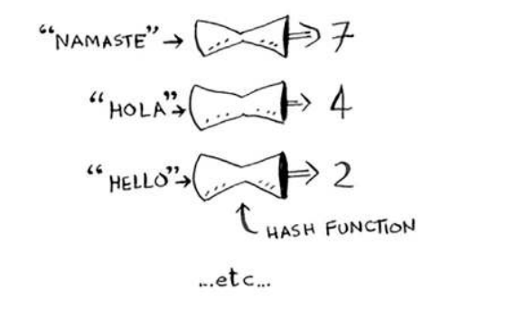
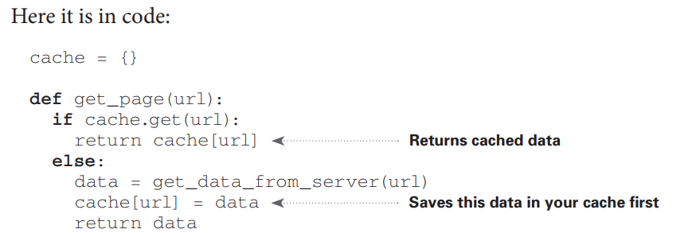
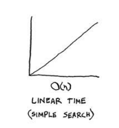
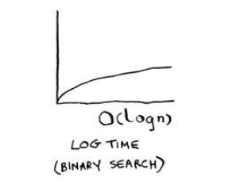
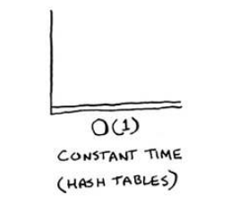
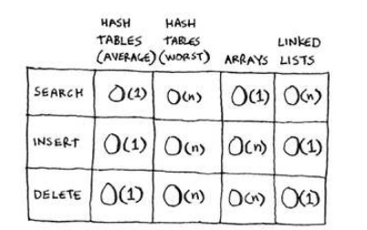
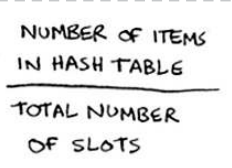
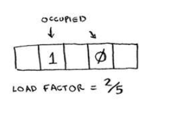

## Chapter 05

• You learn about hash tables, one of the most
useful basic data structures. Hash tables have many
uses; this chapter covers the common use cases.

• You learn about the internals of hash tables:
implementation, collisions, and hash functions.
This will help you understand how to analyze a
hash table’s performance.

## Hash functions

A hash function is a function where you put in a string1
 and you get
back a number.

## Use cases

Hash tables are used everywhere. his section will show you a few
use cases.

**Using hash tables for lookups**
Your phone has a handy phonebook built in.
Each name has a phone number associated with it.

Hash tables are
great when you want to

- Create a mapping from one thing to another thing
- Look something up

**Preventing duplicate entries**

Suppose you’re running a voting booth. Naturally, every person can
vote just once. How do you make sure they haven’t voted before? When
someone comes in to vote, you ask for their full name. hen you check
it against the list of people who have voted.

Cache is a common use case for hash tables. A cache is a
temporary storage area where you keep data you might need again
soon. When you need that data again, you can look it up in the cache
instead of recomputing it or fetching it from a slower storage area.

**Using hash tables as a cache**

Here, you make the server do work only if the URL isn’t in the cache.
Before you return the data, though, you save it in the cache. he next
time someone requests this URL, you can send the data from the cache
instead of making the server do the work.

**Recap**

To recap, hashes are good for:
- Modeling relationships from one thing to another thing
- Filtering out duplicates
- Caching/memorizing data instead of making your server do work

**Collisions**

here are two lessons here:
- Your hash function is really important. Your hash function mapped
all the keys to a single slot. Ideally, your hash function would map
keys evenly all over the hash.
- If those linked lists get long, it slows down your hash table a lot. But
they won’t get long if you use a good hash function!

Hash functions are important. A good hash function will give you very
few collisions. So how do you pick a good hash function? hat’s coming
up in the next section!

**Performance**

In the average case, hash tables take O(1) for everything. O(1) is called
constant time. You haven’t seen constant time before. It doesn’t mean 
instant. It means the time taken will stay the same, regardless of how
big the hash table is. For example, you know that simple search takes
linear time.

Binary search is faster—it takes log time:

Looking something up in a hash table takes constant time.

See how it’s a lat line? hat means it doesn’t matter whether your hash
table has 1 element or 1 billion elements—getting something out of
a hash table will take the same amount of time. Actually, you’ve seen
constant time before. Getting an item out of an array takes constant
time. It doesn’t matter how big your array is; it takes the same amount
of time to get an element. In the average case, hash tables are really fast.

**Hash Tables vs Arrays vs Linked Lists**

Look at the average case for hash tables. Hash tables are as fast as arrays
at searching (getting a value at an index). And they’re as fast as linked
lists at inserts and deletes. It’s the best of both worlds! But in the worst
case, hash tables are slow at all of those. So it’s important that you don’t
hit worst-case performance with hash tables. And to do that, you need
to avoid collisions. To avoid collisions, you need:
- **A low load factor**
- **A good hash function**

**Load factor**
The load factor of a hash table
is easy to calculate.

Formula:
    Load Factor = Number of Entries / Number of Slots

Hash tables use an array for storage, so you count the number of
occupied slots in an array. For example, this hash table has a load factor
of 2/5, or 0.4.

Having a load factor
greater than 1 means you have more items than slots in your array.
Once the load factor starts to grow, you need to add more slots to your
hash table. his is called resizing.You need to resize this hash table. First you create a new array that’s
bigger. he rule of thumb is to make an array that is twice the size.Now you need to re-insert all of those items into this new hash table using the hash function. 

You might be thinking, “his resizing business takes a lot of time!” And
you’re right. Resizing is expensive, and you don’t want to resize too
oten. But averaged out, hash tables take O(1) even with resizing.

**A good hash function**
A good hash function distributes values in the array evenly

A bad hash function groups values together and produces a lot of
collisions.

What is a good hash function? hat’s something you’ll never have to
worry about—old men (and women) with big beards sit in dark rooms
and worry about that. If you’re really curious, look up the SHA function
(there’s a short description of it in the last chapter). You could use that
as your hash function.

## Recap

You’ll almost never have to implement a hash table yourself. he
programming language you use should provide an implementation for
you. You can use Python’s hash tables and assume that you’ll get the
average case performance: constant time.
Hash tables are a powerful data structure because they’re so fast and
they let you model data in a diferent way. You might soon ind that
you’re using them all the time:

- You can make a hash table by combining a hash function
with an array.
- Collisions are bad. You need a hash function that
minimizes collisions.
- Hash tables have really fast search, insert, and delete.
- Hash tables are good for modeling relationships from one
item to another item.
- Once your load factor is greater than .07, it’s time to resize
your hash table.
- Hash tables are used for caching data (for example, with
a web server).
- Hash tables are great for catching duplicates.

