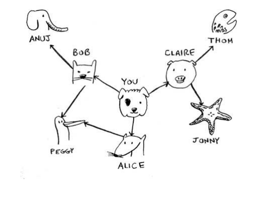
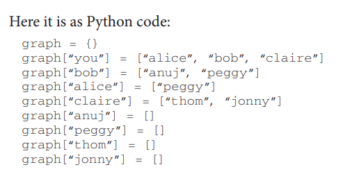
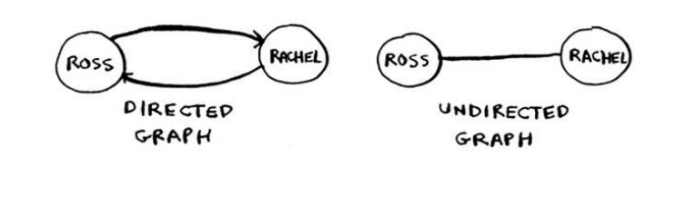
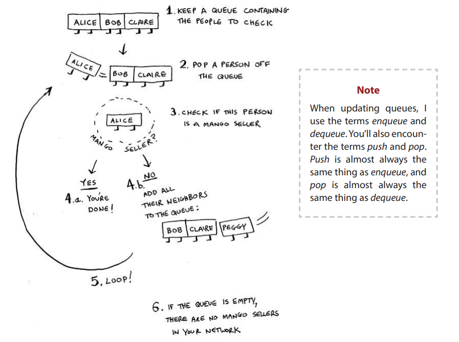
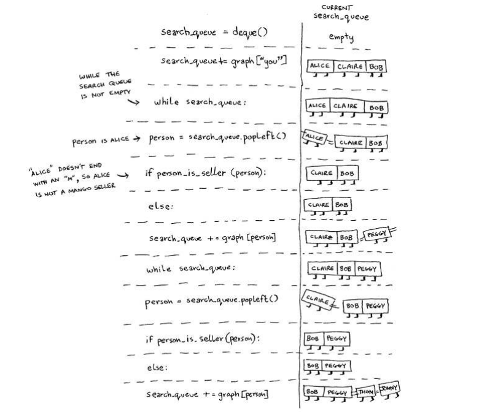
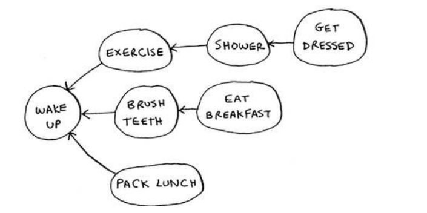
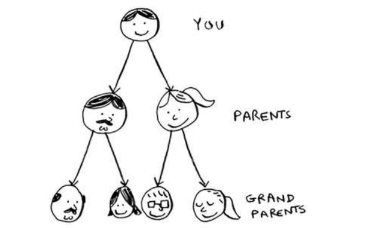
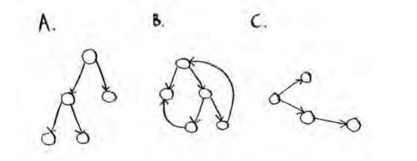

## Chapter 06

- You learn how to model a network using a new,
abstract data structure: graphs.
- You learn breadth-irst search, an algorithm you
can run on graphs to answer questions like,
“What’s the shortest path to go to X?”
- You learn about directed versus undirected graphs.
- You learn topological sort, a diferent kind of
sorting algorithm that exposes dependencies
between nodes.

his chapter introduces graphs. First, I’ll talk about what graphs
are (they don’t involve an X or Y axis). hen I’ll show you your irst
graph algorithm. It’s called breadth-irst search (BFS).

Breadth-irst search allows you to ind the shortest distance
between two things. But shortest distance can mean a lot of things! 

You can use breadth-irst search to:

- Write a checkers AI that calculates the fewest moves to victory
- Write a spell checker (fewest edits from your misspelling to a real word—for example, READED -> READER is one edit)
- Find the doctor closest to you in your network

Graph algorithms are some of the most useful algorithms I know. Make
sure you read the next few chapters carefully—these are algorithms
you’ll be able to apply again and again.

## Breadth-first search (BFS)

We looked at a search algorithm in chapter 1: binary search. Breadthirst search is a diferent kind of search algorithm: one that runs on
graphs. It can help answer two types of questions:

- Question type 1: Is there a path from node A to node B?
- Question type 2: What is the shortest path from node A to node B?
- 
## Finding the shortest path

Breadth First Search (Busca em Largura)

As a recap, these are the two questions that breadth-first search can
answer for you:
- Question type 1: Is there a path from node A to node B? (Is there a mango seller in your network?)
- Question type 2: What is the shortest path from node A to node B?
(Who is the closest mango seller?)

## Queues (FIFO - First In First Out)

A queue works exactly like it does in
real life. Suppose you and your friend
are queueing up at the bus stop. If you’re
before him in the queue, you get on the
bus first. A queue works the same way.
Queues are similar to stacks. You can’t
access random elements in the queue.
Instead, there are two only operations,
enqueue and dequeue.

A graph is just a bunch of nodes and edges, so this is all you need to
have a graph in Python. What about a bigger graph, like this one?

Anuj, Peggy, hom, and Jonny don’t have any neighbors. hey have
arrows pointing to them, but no arrows from them to someone else.
his is called a directed graph—the relationship is only one way. So Anuj
is Bob’s neighbor, but Bob isn’t Anuj’s neighbor. An undirected graph
doesn’t have any arrows, and both nodes are each other’s neighbors. For
example, both of **these graphs are equal**.

## Running time

If you search your entire network for a mango seller, that means you’ll
follow each edge (remember, an edge is the arrow or connection from
one person to another). So the running time is at least O(number of
edges).

You also keep a queue of every person to search. Adding one person to
the queue takes constant time: O(1). Doing this for every person will
take O(number of people) total. Breadth-irst search takes O(number of
people + number of edges), and it’s more commonly written as O(V+E)
(V for number of vertices, E for number of edges).

You could say that this list is sorted, in a way. If task A depends on
task B, task A shows up later in the list. his is called a topological sort,
and it’s a way to make an ordered list out of a graph. Suppose you’re
planning a wedding and have a large graph full of tasks to do—and
you’re not sure where to start. You could **topologically sort** the graph
and get a list of tasks to do, in order.

Suppose you have a family tree.

This is a graph, because you have nodes (the people) and edges.
he edges point to the nodes’ parents. But all the edges go down—it
wouldn’t make sense for a family tree to have an edge pointing back up!
That would be meaningless—your dad can’t be your grandfather’s dad!

This is called a tree. A tree is a special type of graph, where no edges
ever point back. 

## Exercises 

Which of the following graphs are also trees?

Answers: A—Tree; B—Not a tree; C—Tree. The last example is
just a sideways tree. Trees are a subset of graphs. "So a tree is always
a graph, but a graph may or may not be a tree."

## Recap
- Breadth-first search tells you if there’s a path from A to B.
- If there’s a path, breadth-first search will find the shortest path.
- If you have a problem like “find the shortest X,” try modeling your
problem as a graph, and use breadth-first search to solve.
- A directed graph has arrows, and the relationship follows the
direction of the arrow (rama -> adit means “rama owes adit money”).
- Undirected graphs don’t have arrows, and the relationship goes both
ways (ross - rachel means “ross dated rachel and rachel dated ross”).
- Queues are FIFO (First In, First Out).
- Stacks are LIFO (Last In, First Out).
- You need to check people in the order they were added to the search
list, so the search list needs to be a queue. Otherwise, you won’t get
the shortest path.
- Once you check someone, make sure you don’t check them again.
Otherwise, you might end up in an ininite loop.

Current page: 134