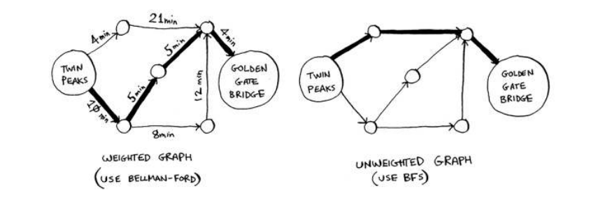
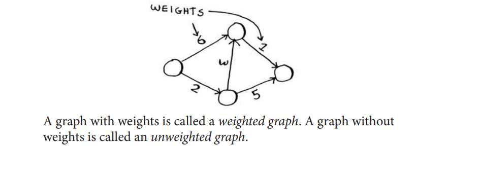
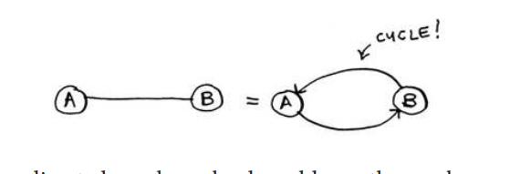
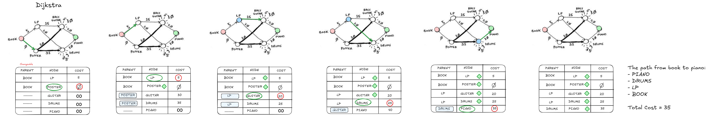
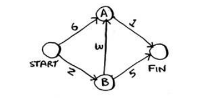
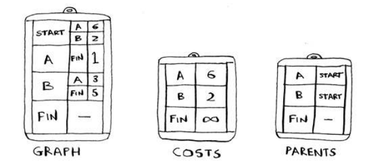
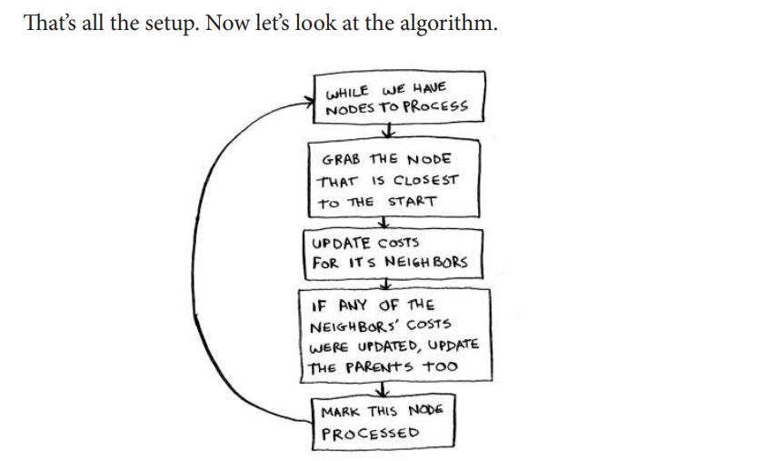

## Chapter 07

- We continue the discussion of graphs, and you
learn about weighted graphs: a way to assign
more or less weight to some edges.
- You learn Dijkstra’s algorithm, which lets you
answer “What’s the shortest path to X?” for
weighted graphs.
- You learn about cycles in graphs, where
Dijkstra’s algorithm doesn’t work.

## BFS and Dijkstra’s algorithm
In the last chapter, you used breadth-first search to find the shortest
path between two points. Back then, “shortest path” meant the path
with the fewest segments. But in Dijkstra’s algorithm, you assign a
number or weight to each segment. Then Dijkstra’s algorithm finds the
path with the smallest total weight.

## Dijkstra’s algorithm

To recap, Dijkstra’s algorithm has four steps:
1. Find the cheapest node. This is the node you can get to in the least
amount of time.
2. Check whether there’s a cheaper path to the neighbors of this node.
If so, update their costs.
3. Repeat until you’ve done this for every node in the graph.
4. Calculate the final path. (Coming up in the next section!)

## Terminology
I want to show you some more examples of Dijkstra’s algorithm in
action. But first let me clarify some terminology.
When you work with Dijkstra’s algorithm, each edge in the graph has a
number associated with it. These are called weights.

An undirected graph means that both nodes point to each other. hat’s
a cycle!

With an undirected graph, each edge adds another cycle.
Dijkstra’s algorithm only works with directed acyclic graphs,
called DAGs for short.

## Dijkstra’s algorithm in action

This is the key idea behind Dijkstra’s algorithm: Look at the cheapest
node on your graph. There is no cheaper way to get to this node!

## Negative-weight edges
So you can’t use negative-weight edges
with Dijkstra’s algorithm. If you want to ind the shortest path in a graph
that has negative-weight edges, there’s an algorithm for that! It’s called
the **Bellman-Ford algorithm**.

Excalidraw that i made about the iteration of Dijkstra’s algorithm.

## Implementation of Dijkstra’s algorithm

Let’s see how to implement Dijkstra’s algorithm in code. Here’s the
graph I’ll use for the example.

To code this example, you’ll need three hash tables.

That's all the setup. Now let's look at the algorithm.

## Recap

- Breadth-first search is used to calculate the shortest path for
an unweighted graph.
- Dijkstra’s algorithm is used to calculate the shortest path for
a weighted graph.
- Dijkstra’s algorithm works when all the weights are positive.
- If you have negative weights, use the Bellman-Ford algorithm.

Current page: 160