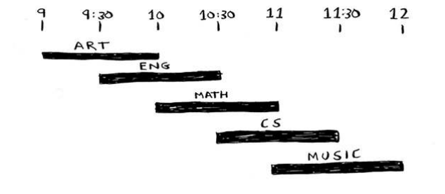
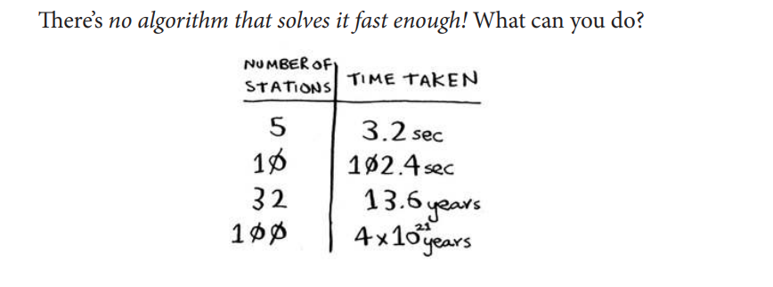

# Chapter 08 - Greedy Algorithms

In this chapter:
- You learn how to tackle the impossible:
problems that have no fast algorithmic solution
(NP-complete problems).
- You learn how to identify such problems when you
see them, so you don’t waste time trying to ind a
fast algorithm for them.
- You learn about approximation algorithms, which
you can use to ind an approximate solution to an
NP-complete problem quickly.
- You learn about the greedy strategy, a very simple
problem-solving strategy.

## The classroom scheduling problem
Suppose you have a classroom and want to hold as many classes
here as possible. You get a list of classes.

You can’t hold all of these classes in there, because some of them
overlap.

You want to hold as many classes as possible in this classroom. How
do you pick what set of classes to hold, so that you get the biggest set of
classes possible?

1. Pick the class that ends the soonest. his is the irst class you’ll hold
in this classroom.
2. Now, you have to pick a class that starts ater the irst class.
Again, pick the class that ends the soonest. his is the second
class you’ll hold.

## The set-covering problem

Suppose you’re starting a radio show. You want to
reach listeners in all 50 states. You have to decide what
stations to play on to reach all those listeners. It costs
money to be on each station, so you’re trying to minimize the
number of stations you play on. You have a list of stations.

Each station covers a region, and
there’s overlap.
How do you igure out the smallest set of
stations you can play on to cover all 50
states? Sounds easy, doesn’t it? Turns out
it’s extremely hard. Here’s how to do it:

1. List every possible subset of stations.
his is called the power set. here are
2^n possible subsets.

2. From these, pick the set with the smallest number of stations that
covers all 50 states. 

he problem is, it takes a long time to calculate every possible subset
of stations. It takes O(2^n) time, because there are 2^n stations. It’s
possible to do if you have a small set of 5 to 10 stations. But with all
the examples here, think about what will happen if you have a lot of
items. It takes much longer if you have more stations. Suppose you can
calculate 10 subsets per second.

There’s no algorithm that solves it fast enough! What can you do? (Approximation algorithms...)

## Approximation algorithms

Greedy algorithms to the rescue! Here’s a greedy algorithm that comes
pretty close:

1. Pick the station that covers the most states that haven’t been covered
yet. It’s OK if the station covers some states that have been covered
already.
2. Repeat until all the states are covered.

To recap:
• Sets are like lists, except sets can’t have duplicates.
• You can do some interesting operations on sets, like union,
intersection, and diference.

## Greedy algorithms

An algorithm is greedy if:

- It builds the solution step by step.
- At each step, it chooses the locally optimal choice.
- It does not reconsider previous decisions.
- It hopes that these local choices lead to a global optimal solution.

*A greedy algorithm makes the best immediate choice without thinking about future consequences.*

A greedy algorithm:

✅ May be fast

❌ May be slow

✅ May give optimal result

❌ May give suboptimal result

## NP-complete problems

there’s no easy way to tell if the problem you’re working
on is NP-complete. Here are some giveaways:

- Your algorithm runs quickly with a handful of items but really slows
down with more items.
- “All combinations of X” usually point to an NP-complete problem.
- Do you have to calculate “every possible version” of X because you
can’t break it down into smaller sub-problems? Might be
NP-complete.
- If your problem involves a sequence (such as a sequence of cities, like
traveling salesperson), and it’s hard to solve, it might be NP-complete.
- If your problem involves a set (like a set of radio stations) and it’s hard
to solve, it might be NP-complete.
- Can you restate your problem as the set-covering problem or the
traveling-salesperson problem? hen your problem is deinitely
NP-complete.

## Recap
- Greedy algorithms optimize locally, hoping to end up with a global
optimum.
- NP-complete problems have no known fast solution.
- If you have an NP-complete problem, your best bet is to use an
approximation algorithm.
- Greedy algorithms are easy to write and fast to run, so they make
good approximation algorithms.

Current page: 180

## Code

- [[approximation-algorithm-np-problem.py]] — greedy set-covering approximation for the radio-station problem.

---

**Navigation:** [[Chapter 07 - Dijkstra's Algorithm|← Previous]] · [[Grokking Algorithms|📚 Index]] · [[Chapter 09 - Dynamic Programming|Next →]]