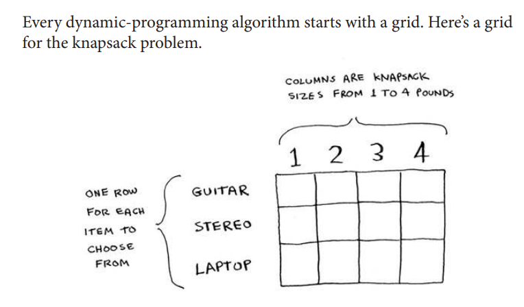
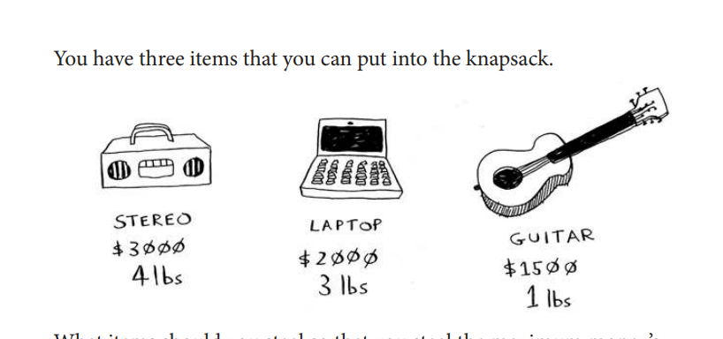

# Chapter 09 - Dynamic Programming

- You learn dynamic programming, a
technique to solve a hard problem by
breaking it up into subproblems and
solving those subproblems irst.
- Using examples, you learn to how to come up
with a dynamic programming solution to a
new problem.

## The knapsack problem
Suppose you’re a burglar breaking into a house. You have a knapsack that can hold a certain amount of weight. You want to ill it with the most valuable items you can ind. You have a list of items, each with a weight and a value. You want to pick the items that give you the most value, without going over the weight limit of your knapsack. How do you do it?

## Dynamic programming
Answer: With dynamic programming! Let’s see how the dynamicprogramming algorithm works here. Dynamic programming starts by
solving subproblems and builds up to solving the big problem.

For each thing you want to see, you write down how long it will take
and rate how much you want to see it. 

last page : 196

---

**Navigation:** [[Chapter 08 - Greedy Algorithms|← Previous]] · [[Grokking Algorithms|📚 Index]]